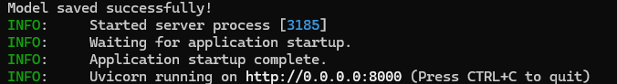
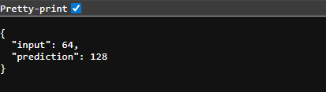

# Linear Regression Model Example

> A clean, minimal ML pipeline built with `scikit-learn` — covering data generation, model training, serialization, and prediction.


---

##  Overview

This project demonstrates a complete **Linear Regression ML pipeline** using `scikit-learn`. It's a great starting point if you're getting into ML engineering or data science. The model is trained on synthetic data and saved as a reusable `.pkl` file — ready to plug into an API or any downstream application.

---

##  Features

-  Generates synthetic regression data using `scikit-learn`
-  Trains a `LinearRegression` model
-  Serializes and saves the trained model as `model.pkl`
-  Ready-to-use for real-time or batch predictions
-  Clean, beginner-friendly project structure

---

##  Project Structure

```
ml-api-demo/
│
├── main.py               # Main script: data gen, training, saving
├── model.pkl             # Saved trained model (generated on run)
├── requirements.txt      # Project dependencies
├── screenshots/          # Terminal & prediction output screenshots
│   ├── terminal.png
│   └── predict.png
└── README.md
```

---

##  Installation

### 1. Clone the repo

```bash
git clone https://github.com/Nuwantha2/ml-api-demo.git
cd ml-api-demo
```

### 2. Create a virtual environment (recommended)

```bash
# Create venv
python3 -m venv venv

# Activate — Linux/Mac
source venv/bin/activate

# Activate — Windows
venv\Scripts\activate
```

### 3. Install dependencies

```bash
pip install -r requirements.txt
```

### 4. Run the script

```bash
python main.py
```

>  This will train the model and generate `model.pkl` in the project root.

---

## 🔮 Making Predictions

After running `main.py`, you can load the saved model and make predictions like this:

```python
import pickle
import numpy as np

# Load the saved model
with open("model.pkl", "rb") as f:
    model = pickle.load(f)

# Predict on new data
X_new = np.array([[1.5], [2.3], [3.7]])
predictions = model.predict(X_new)
print("Predictions:", predictions)
```

---

##  Screenshots

**Model Training Output:**



**Prediction Example:**



---

##  Dependencies

| Package | Purpose |
|---|---|
| `scikit-learn` | ML model training & data generation |
| `numpy` | Numerical operations |
| `pickle` | Model serialization |

Install all at once:

```bash
pip install -r requirements.txt
```

---

##  What's Next?

Some ideas to level this project up:

-  Wrap the model in a **FastAPI** or **Flask** REST API
-  Add **model evaluation metrics** (MSE, R² score)
-  Visualize predictions vs actuals with **matplotlib**
-  Deploy to **Heroku**, **Render**, or **AWS Lambda**
-  Swap synthetic data for a **real-world dataset**

---

##  Contributing

Contributions are welcome! Feel free to fork the repo, open issues, or submit PRs.

1. Fork the project
2. Create your feature branch (`git checkout -b feature/cool-feature`)
3. Commit your changes (`git commit -m 'Add cool feature'`)
4. Push to the branch (`git push origin feature/cool-feature`)
5. Open a Pull Request

---

##  License

This project is licensed under the **MIT License** — do whatever you want with it, fr.

---

##  Author

**Nuwantha** — [@Nuwantha2](https://github.com/Nuwantha2)

